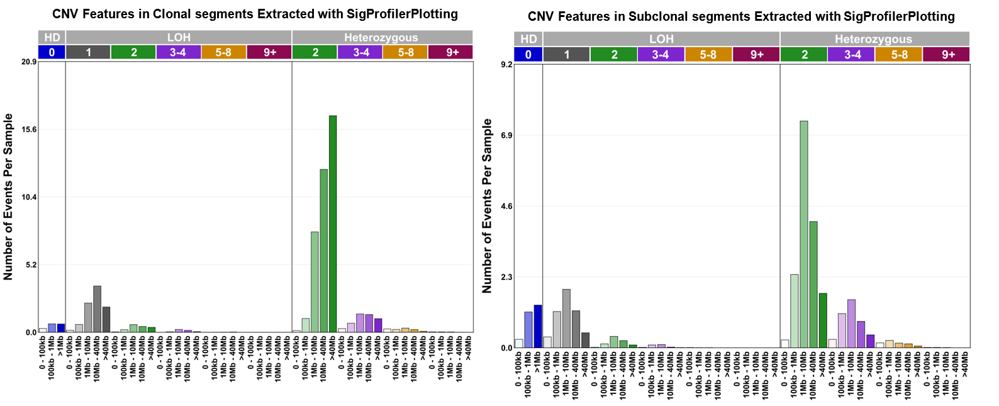

### This folder containts files and script related to running **SigProfilerPlotting**. Paths and variables need changing according to each environment:

### `Example_Input.txt`

Example of a CNV classification table which can be used in running SigProfilerPlotting. 

---

### `RUN.py`

Includes the script for running SigProfilerPlotting (version 1.3.2), given that it is previously installed.
Dependencies: matplotlib (version 3.4.3), pandas (version 1.3.5) and seabron (version 0.12.2) 

---

### `Figures/`

This directory contains the figures generated using RUN.py on the full mutation dataset.
  
  

**1. Distribution of CNV event counts by genotype state and segment length extracted with SigProfilerPlotting.**

---

### `References:`

**SigProfilerPlotting:** https://github.com/AlexandrovLab/SigProfilerPlotting

**matplotlib:** https://github.com/matplotlib/matplotlib

**pandas:** https://github.com/pandas-dev/pandas

**seaborn:** https://github.com/mwaskom/seaborn
