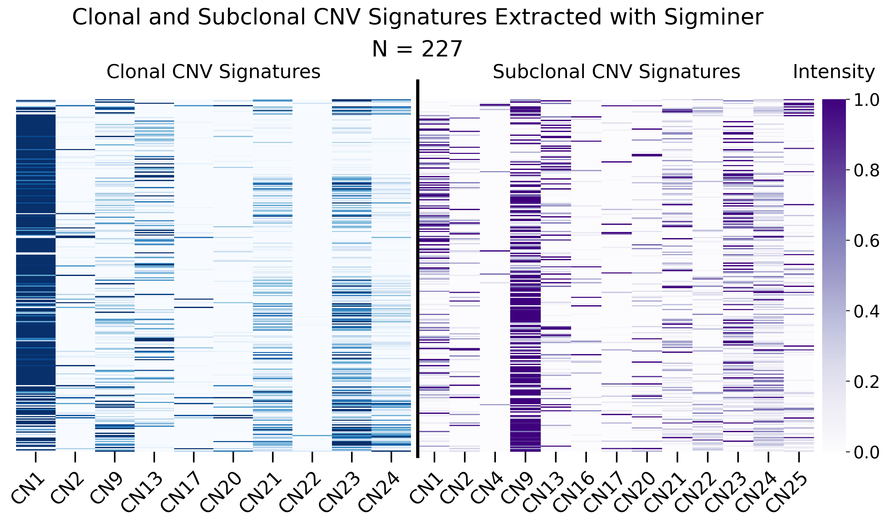
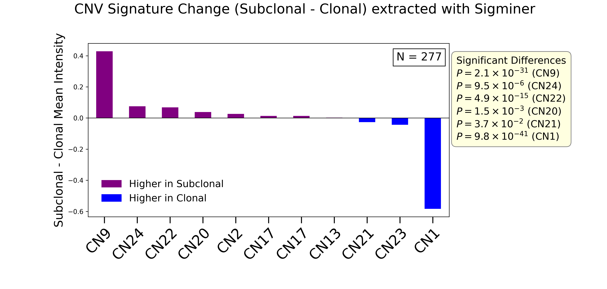
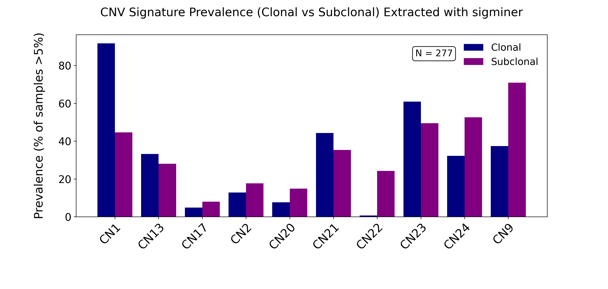
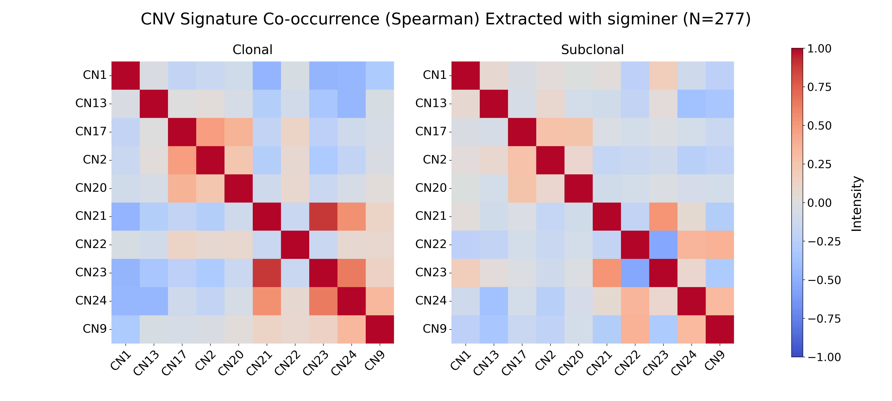

### This folder containts files and script related to running **Sigminer**. Paths and variables need changing according to each environment:

### `Example_Input.txt`
Example of a CNV classification table which can be used in running panConusig. 

---

### `RUN.R`
Includes the R script for running Sigminer (version 2.3.1).

---

### `Plots.py`

Running this script creates the figures in `Figures\` directory.

---

### `Figures/`

This directory contains the figures generated using Plots.py on the full mutation dataset.

**1. Heatmap of clonal and subclonal CNV signatures extracted using Sigminer (N = 227).**

**2. Differential activity of CNV signatures between subclonal and clonal compartments (N = 277).**

**3. Prevalence of CNV signatures in clonal and subclonal compartments (N = 277).**

**4. Co-occurrence patterns of CNV signatures in clonal and subclonal compartments (N = 277).**

---

### `References:`

**Sigminer:** https://github.com/ShixiangWang/sigminer