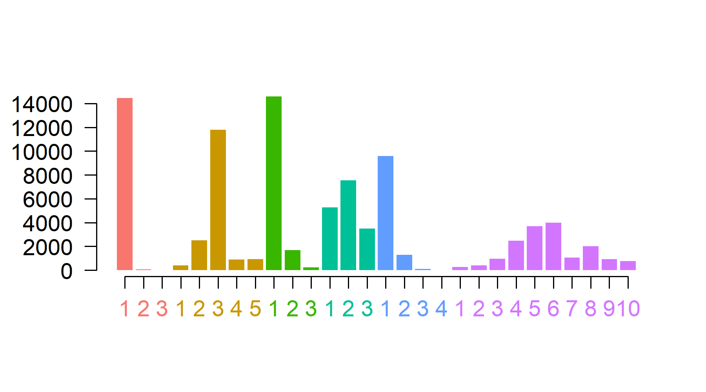
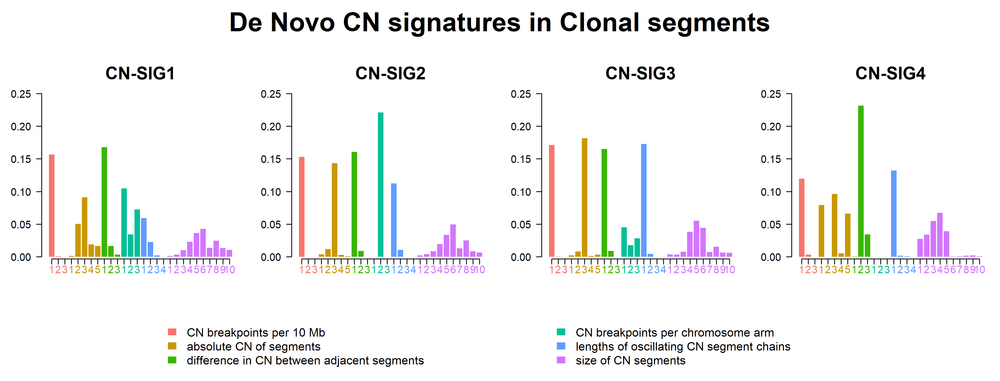
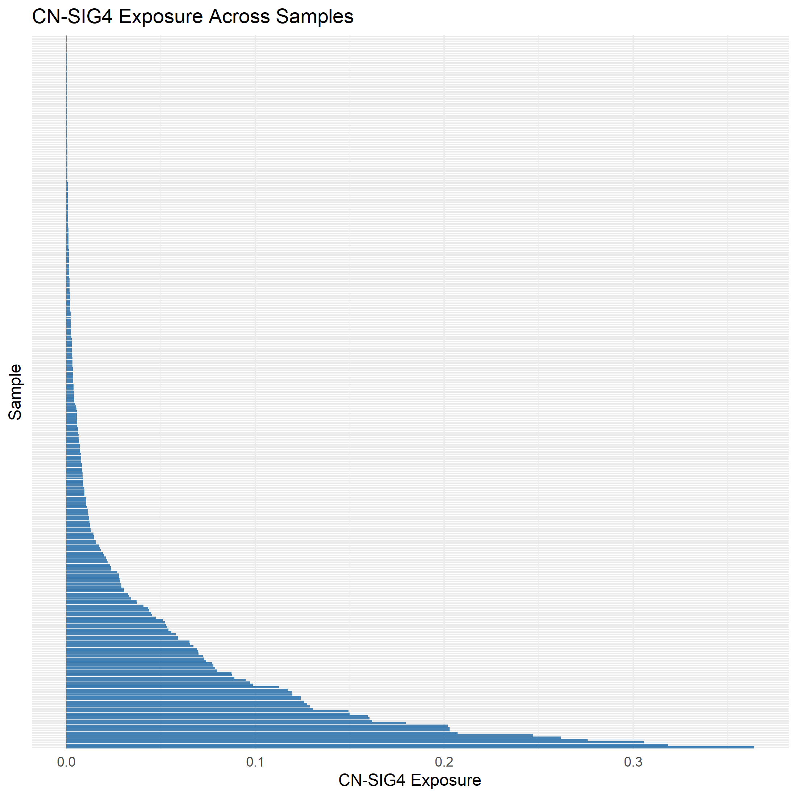

### This folder containts files and script related to running **Chromothripsis analysis** based on Maclachlan et al., paper. Paths and variables need changing according to each environment:

### `Example_Input.txt`

Example of a CNV classification table which can be used in running chromothripsis analysis. 

---

### `RUN.R`

Includes the R script for running chromothripsis analysis.
Dependencies: GenomicRanges (version 1.58.0), mclust (version 6.1.1), and hdp (version 0.1.5).

---

### `Figures/`

This directory contains the figures generated using RUN.py on the full mutation dataset. Only clonal figures are included in this directory.
  
  

**1. Overall de novo CN-feature counts.**
  
  

**2. De novo copy-number (CN) signatures obtained based on (Maclachlan et al., 2021) paper.**
  
  

**3. Per-sample exposure to chromothripsis-associated de novo CN signatures.**

---

### `References:`

**Implemented pipeline from:** Maclachlan, K.H., Rustad, E.H., Derkach, A. et al. Copy number signatures predict chromothripsis and clinical outcomes in newly diagnosed multiple myeloma. Nat Commun 12, 5172 (2021). https://doi.org/10.1038/s41467-021-25469-8

**hdp:** https://github.com/nicolaroberts/hdp

**mclust:** https://mclust-org.github.io/mclust/

**GenomicRanges:** https://github.com/Bioconductor/GenomicRanges
