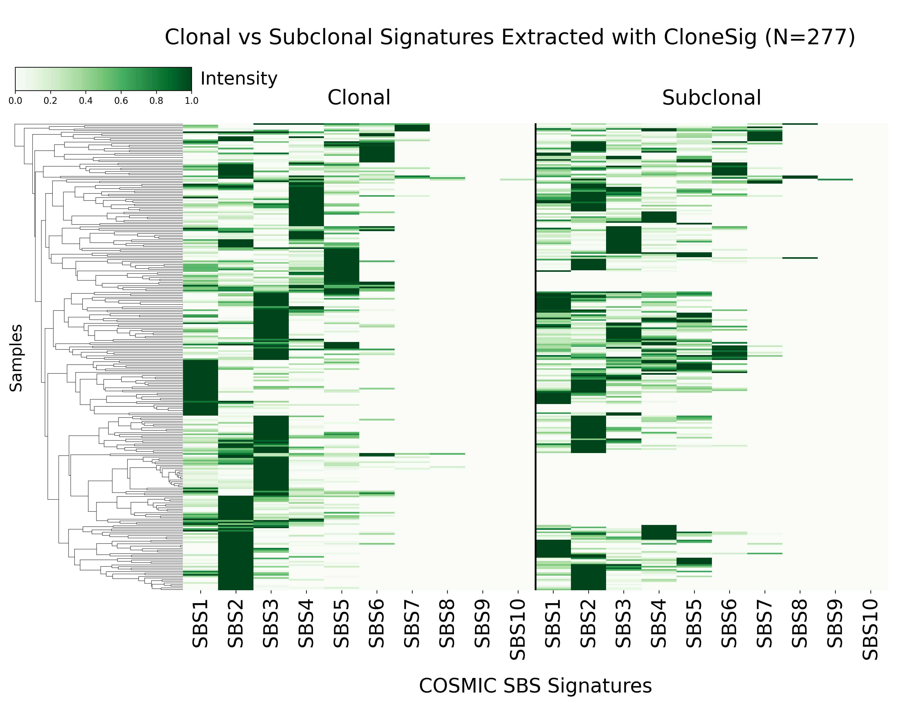
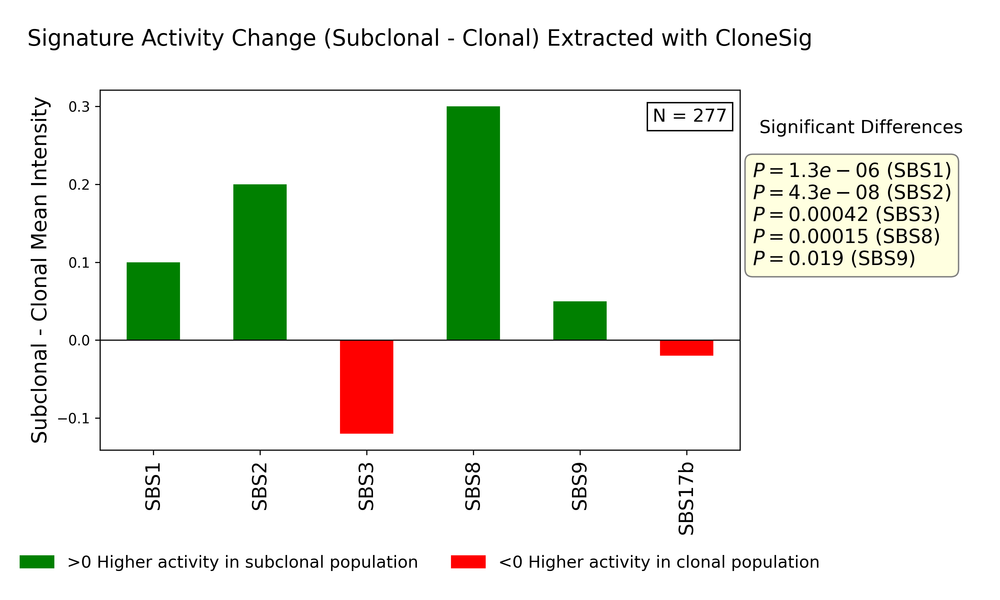

### This folder contains files and script related to running **CloneSig**. Paths and variables need changing according to each environment:

### `Example_Input.txt`

An example of mutation table which can be used for CloneSig.

---

### `RUN.py`

Includes the script for running CloneSig (version 0.1), given that it is previously installed.
Dependencies: Numpy (version 1.21.6), pandas (version 1.3.5) and scikit-learn (version 0.20.4) 

---

### `Example_Output.txt`

A table, and two plots will be created for each sample, in different directories named after the samples. Example_Output.txt shows a few rows of the generated table with CloneSig for 3 samples.

---

### `Plots.py`

Includes the script and code blocks to generate the fiugres from the tables generated for each sample.

---

### `Figures/`

This directory contains the figures generated using Plots.py on the full mutation dataset.

**1. Heatmaps showing SBS signature activities in clonal and subclonal segments as extracted by CloneSig across 277 patient samples.**

**2. Differences in SBS signature activities between subclonal and clonal segments as identified by CloneSig.**

---

### `References:`

**SigProfilerAssignment:** https://github.com/AlexandrovLab/SigProfilerAssignment

**Numpy:** https://github.com/numpy/numpy

**pandas:** https://github.com/pandas-dev/pandas

**scikit-learn:** https://github.com/scikit-learn/scikit-learn
