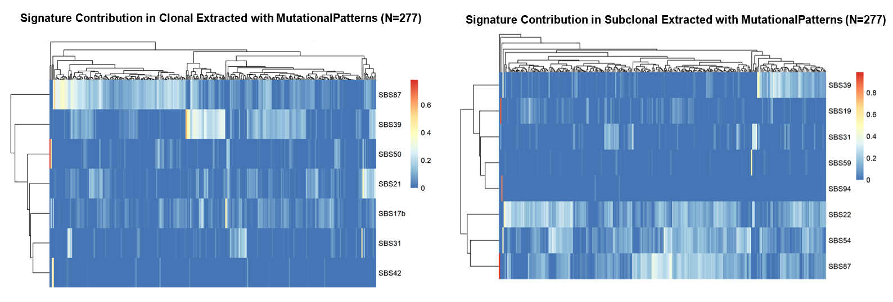

### This folder containts files and script related to running **MutationalPatterns**. Paths and variables need changing according to each environment:

### `Example_Input.txt`
Example of a mutation table which can be used in running MutationalPatterns. 

---

### `RUN.R`
Includes the R script for running MutationalPatterns (version 3.16.0) and plotting the results.
Dependencies: GenomicRanges (version 1.24.0) and NMF (version 0.20.6). 

---

### `Example_Output.txt`
Outputs of running this tool will be a table with sample names as columns and SBS signatures as rows and plots related to this table.

---

### `Figures/`

This directory contains the figure generated using RUN.R on the full mutation dataset.
  
  

**1. MutationalPatterns-derived SBS signature contributions in clonal and subclonal segments.**

---

### `References:`

**MutationalPatterns:** https://github.com/UMCUGenetics/MutationalPatterns

**GenomicRanges:** https://github.com/Bioconductor/GenomicRanges

**NMF:** https://github.com/renozao/NMF

**readr, ggplot2, tidyr:** https://github.com/tidyverse

**pheatmap:** https://github.com/raivokolde/pheatmap
