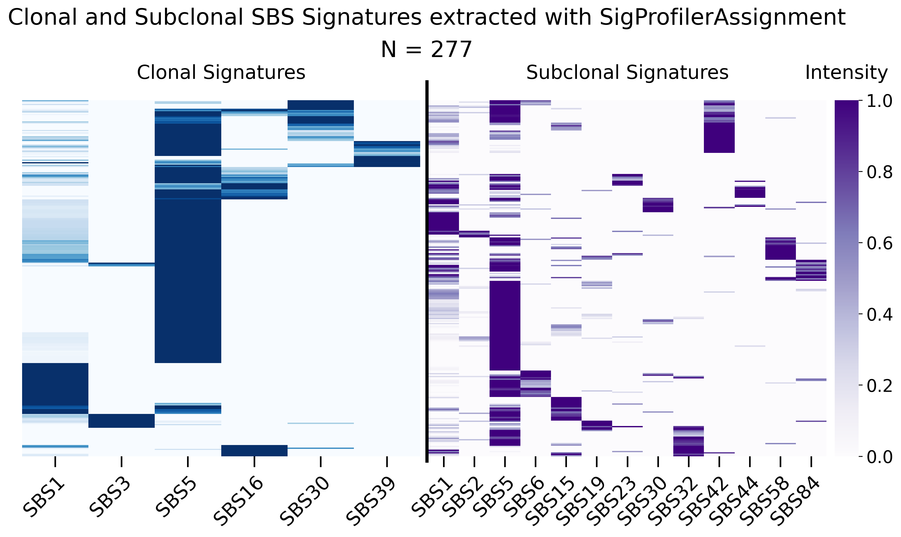
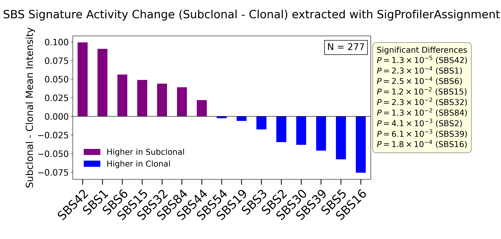
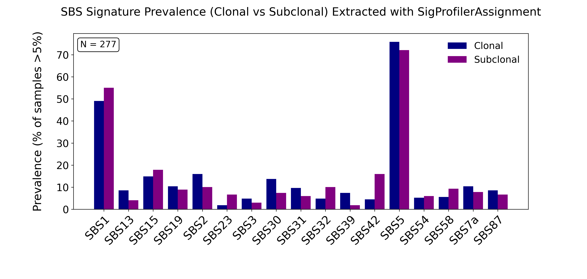
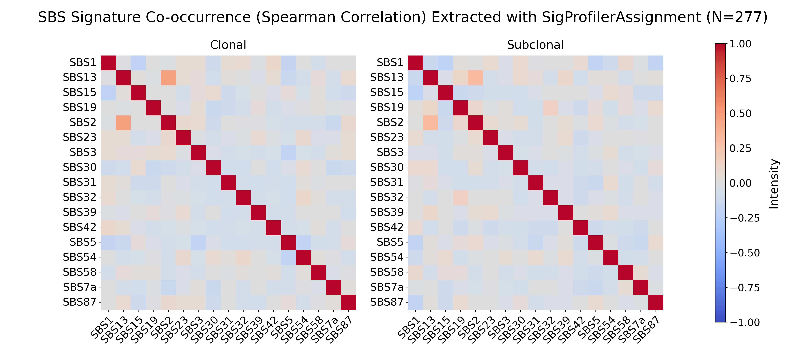

### This folder contains files and script related to running **SigProfilerAssignment**. Paths and variables need changing according to each environment:

### `Example_Input.txt`

Results from SigProfilerMatrixGenerator should be used in this tool, particularly MEDUSA.SBS96.exome. This table shows an example structure of MEDUSA.SBS96.exome. 

---

### `RUN.py`

Includes the script for running SigProfilerAssignment (version 0.0.19), given that it is previously installed.
Dependencies: Numpy (version 1.21.6), pandas (version 1.3.5) and scipy (version 1.7.3) 

---

### `Example_Output.txt`

Output of running this tool will be several folders and files, but the file that will be used for visualization is Assignment_Solution_Activities.txt in Assignment_Solution folder. Example_Output.txt demonstrates how this output file looks like.
In the output file, each sample has a certain value for each signature which can be plotted. 

---

### `Plots.py`

Includes the script and code blocks to generate figures from output table.

---

### `Figures/`

This directory contains the figures generated using Plots.py on the full mutation dataset.

**1. Heatmaps showing the relative contribution of SBS signatures in clonal and subclonal segments from 277 mesothelioma patient samples, extracted with SigProfilerAssignment.**
  
  
  

**2. Comparison of SBS signature activities between subclonal and clonal segments across 277 samples**
  
  
  

**3. Bar plot showing the prevalence of SBS signatures in clonal (navy) and subclonal (purple) segments, defined as the percentage of samples in which the signature’s contribution exceeded 5% (N = 277).**
  
  
  

**4. Spearman correlation heatmaps showing pairwise associations between SBS signature activities in clonal and subclonal segments (N = 277).**

---

### `References:`

**SigProfilerAssignment:** https://github.com/AlexandrovLab/SigProfilerAssignment

**Numpy:** https://github.com/numpy/numpy

**pandas:** https://github.com/pandas-dev/pandas

**scipy:** https://github.com/scipy/scipy
